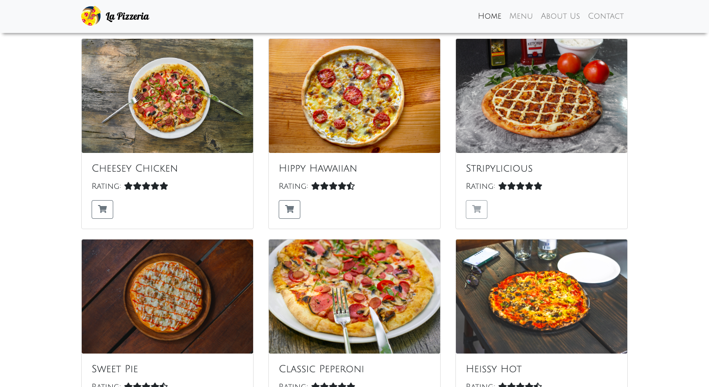

# LA PIZZERIA
####  A web application for a fictional Pizza Shop, 30/8/2019

## Author
Collins Muriuki

## Versioning
La Pizzeria V1.0

## Description
La Pizzeria is a fictional pizza shop located in the Hub Karen, Nairobi with a web application which allows users to make orders. The app has a variety of pizzas to choose from with various options of size, toppings and crust. The user can also request for delivery of the pizza and can order as many pizzas as he or she wishes.

## Features
Here are the features in summary:
* Selection of size of pizza.
* Selection of choice of toppings.
* Selection of choice of crust.
* Opting to have the pizza delivered or picked up.
* Ability to order more than one pizza.

## Installation and Set-up
To view the app, open the Github Pages link provided below on the README.
Here is a run through of how to set up the application
* Step 1 : Clone this repository using **`git clone https://github.com/collinsmuriuki/akan-name-generataor.git`**, or downloading a ZIP file of the code.
* Step 2 : The repository, if downloaded as a .zip file will need to be extracted o your preferred location and opened
* Step 3 : Open the index.html file to view the application on your preferred web browser

## Known Bugs
* User cannot order second pizza of different variety
* User cannot have more than one options for toppings

## Technologies Used
* HTML  
* CSS
* Javascript
* Bootstrap 4.3
* jQuery 3.4.1

## Support and contact details
You can provide feedback or raise any issues/ bugs through the following means:
* murerwacollins@gmail.com

## Github Pages link
You can view the live application by following this link https://collinsmuriuki.github.io/la-pizzeria/

## License
#### [*MIT License*](LICENSE)
